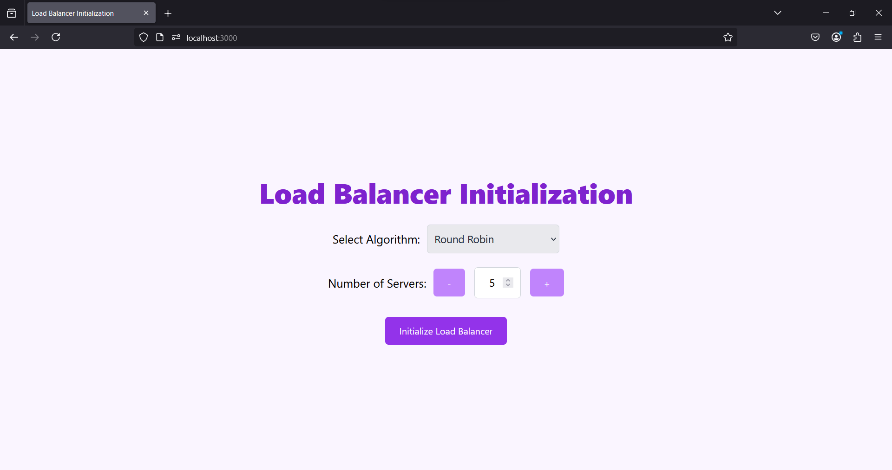
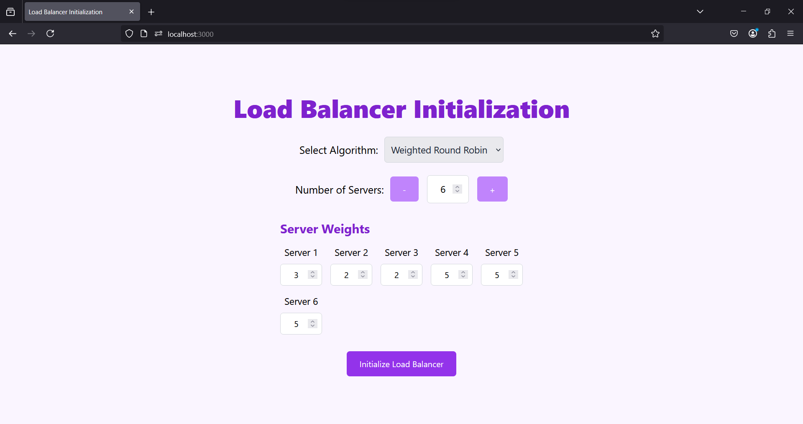
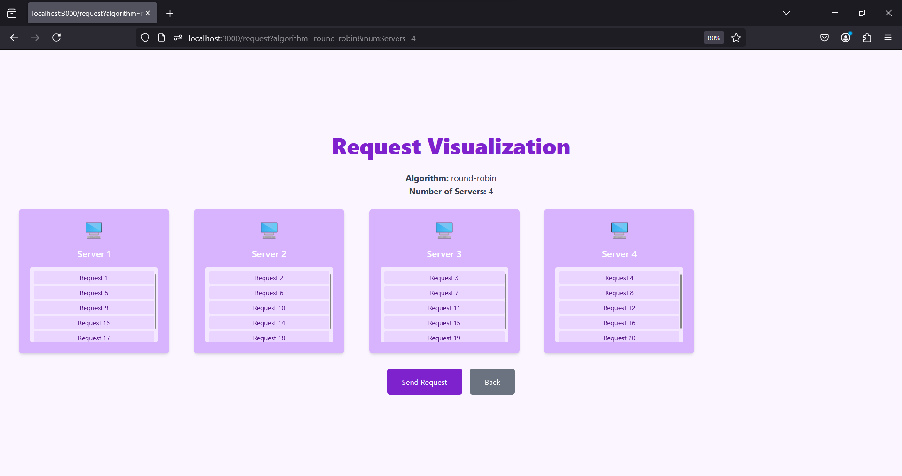
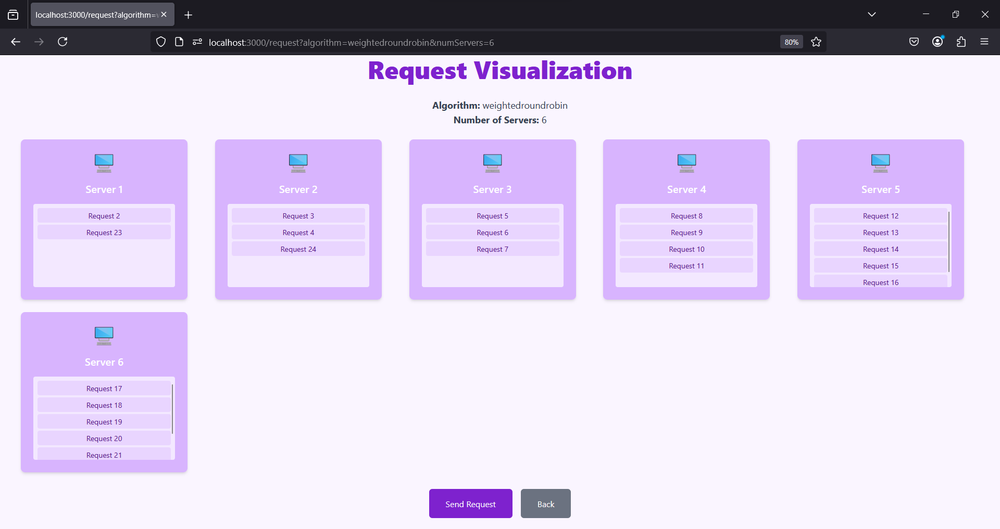
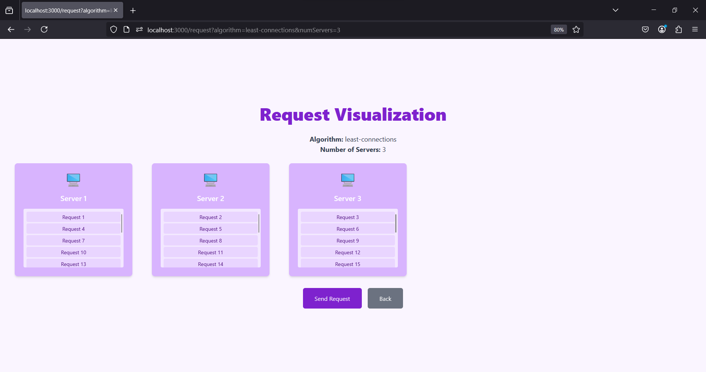

# Load-Balancer-Visulization
Load Balancer Visulization

This project demonstrates various load balancing algorithms through backend simulations and an interactive frontend visualization. The goal is to help students and developers understand how load balancing techniques work in a system design context.

---

## Introduction
Load balancing is a critical concept in system design for distributing client requests or network traffic across multiple servers. It prevents any single server from being overloaded, thereby improving system performance and reliability.


With this project, you can simulate and visualize four common load balancing algorithms:
1. **Round Robin Algorithm**
2. **Weighted Round Robin Algorithm**
3. **Least Connections Algorithm**

## Demo







---

## Algorithms Implemented

### Round Robin Algorithm
Distributes client requests sequentially among servers. This ensures an even distribution of requests across all available servers.

---

### Weighted Round Robin Algorithm
Assigns weights to servers, allowing servers with higher capacities to handle more requests. Requests are distributed based on the weights.

---

### Least Connections Algorithm
Assigns requests to the server with the least number of active connections. This ensures servers with lighter loads are prioritized.

---

---

## Features
- Customizable number of servers and weights for weighted algorithms.
-  Interactive visualizations for each algorithm.
- Real-time representation of request distribution.
- Web-based visualization (Next.js).

---

## Tech Stack
### Backend:
- Java (Core logic and simulations)
- Spring Boot (for serving API endpoints)

### Frontend:
- Next.js (for interactive visualization)
- Tailwind CSS (for modern UI components)

### Tools:
- Git (Version control)

## Getting Started

### Prerequisites
- Java Development Kit (JDK) 8 or higher
- [Maven](https://maven.apache.org/) (optional, for managing dependencies)
- A code editor like eclipse IDE for Java Developers or IntelliJ IDEA or Visual Studio Code
- Node.js & npm

### Installation
1. Clone the repository:
   ```bash
      git clone https://github.com/Dishatimbadiya/LoadBalancerVisulization.git
   ```

2. Open the project in eclipse IDE.

3. Run the main class.

4. Frontend Setup:

    ```bash 
    cd frontend
    npm install
    npm run dev
    ```
5. Open your browser and go to http://localhost:3000 to view the visualization.

### Contributing

Contributions are welcome! To contribute:

1. Fork the repository.
2. Create a feature branch (git checkout -b feature-name).
3. Commit your changes (git commit -m "Add new feature").
4. Push to the branch (git push origin feature-name).
5. Open a Pull Request.
